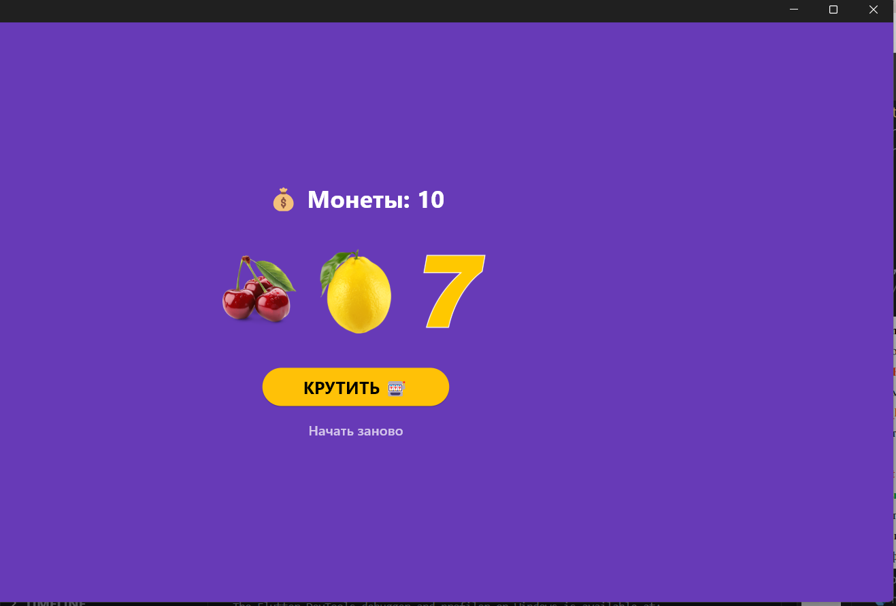

# Лабораторная работа №5-6. Flutter

**Выполнил:** Плеско Д. 
**Группа:** ИСП-231
**Дата сдачи:** 05.05.2026

## Что изучили

1. Разницу между `StatelessWidget` и `StatefulWidget`, механизм хранения и обновления состояния через `setState()`.
2. Асинхронную логику в UI: блокировку интерфейса во время выполнения операции, отключение повторных нажатий.
3. Принцип "раннего выхода" (early return) и тернарные операторы в Dart.
4. Декомпозицию виджетов для улучшения читаемости кода (вынос `SlotRow` в отдельный файл).
5. Создание анимаций через виджеты `AnimatedOpacity` и `AnimatedSwitcher`, реалистичную прокрутку слотов с изменением скорости.

## Скриншот финального приложения



## Инструкция по запуску

1. Клонируйте репозиторий:
   ```bash
   git clone <url>
   ```
2. Перейдите в папку проекта:
   ```bash
   cd slot_machine
   ```
3. Установите зависимости:
   ```bash
   flutter pub get
   ```
4. Запустите приложение:
   ```bash
   flutter run -d chrome
   ```